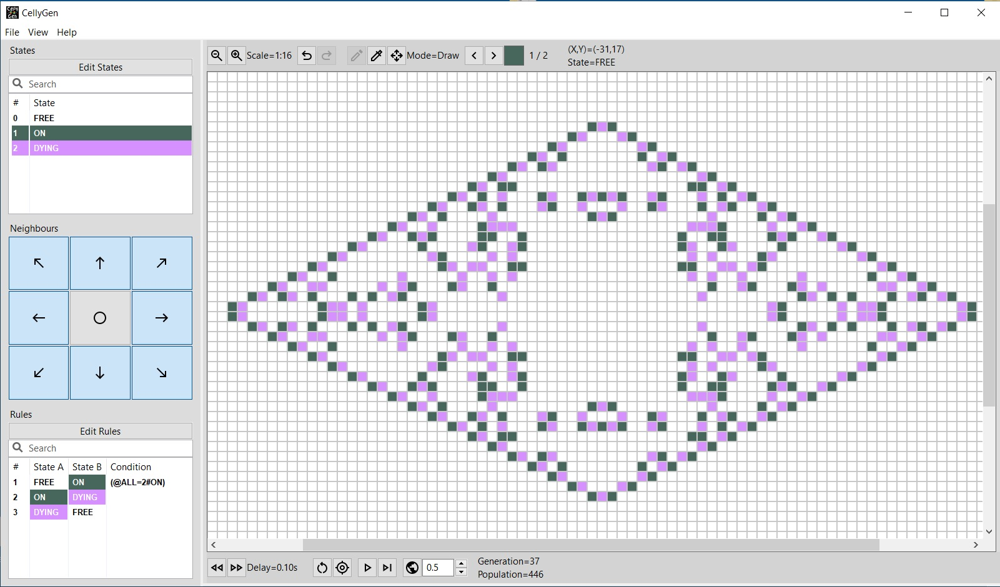

# CellyGen
An application for defining and visualising Cellular Automata with a tool for exploring patterns using genetic algorithms.

_Running "Conway's Game of Life"_

_Running "Brian's Brain"_

_Running "Langton's Ant"_

_Running the GA exploration tool on "Conway's Game of Life"_

_Output of the pattern found by the GA exploration tool_

